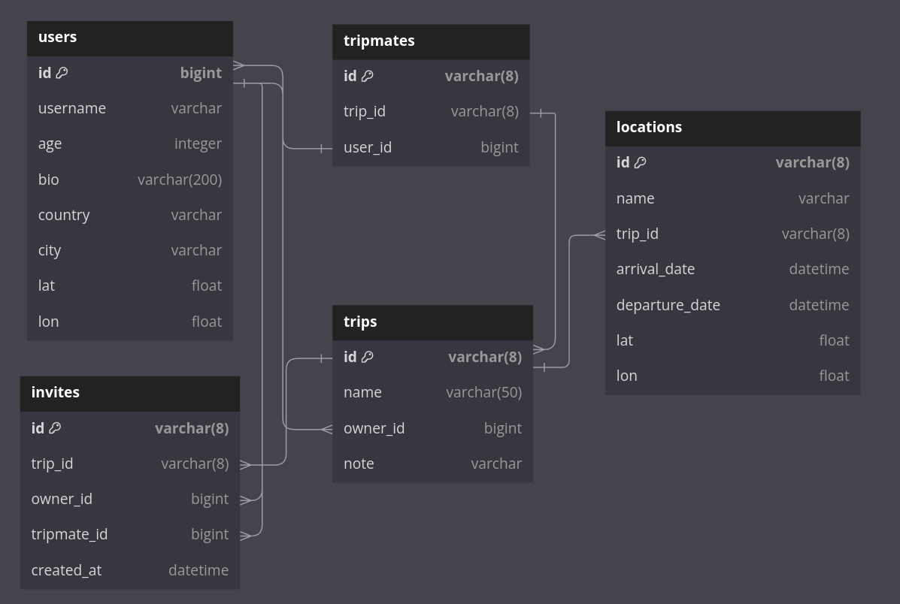

# Телеграм бот для планирования путешествий

Логин бота: [@way_bot_travel_planner_bot](https://t.me/way_bot_travel_planner_bot)

Бот поможет спланировать ваше путешествие путем агрегирования всей инфорации о поездке.

## Запуск

Все, что нужно, это запустить `docker compose` после того, как вы склонируете репозиторий на вашу машину.

```
    docker compose up -d
```

## Основной функционал

- **Регистрация пользователя и изменение пользовательских данных.**
- **Возможность создавать, просматривать, обновлять и удалять путешествия.**
- **Добавление локаций в ваше путешествие для последующего построения маршрута.**
- **Приглашение других пользователей поучавствовать в путешествии (приглашенный пользователь получает доступ к информации о путешествии).**

## Технологии

**Бот выполнен на языке `Python V3.10.12` с использованием библиотеки `Aiogram V3.4.1`**

## Сторонние интеграции

1. **[nominatim.org](https://nominatim.org/release-docs/develop/api/Overview/) - для определения страны и города пользователя через координаты.**
2. **Для построения маршрута использовался сервис [openrouteservice.org](https://openrouteservice.org/) совместно с Python SDK.**

## Схема базы данных


